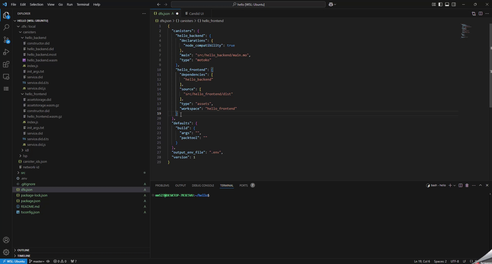
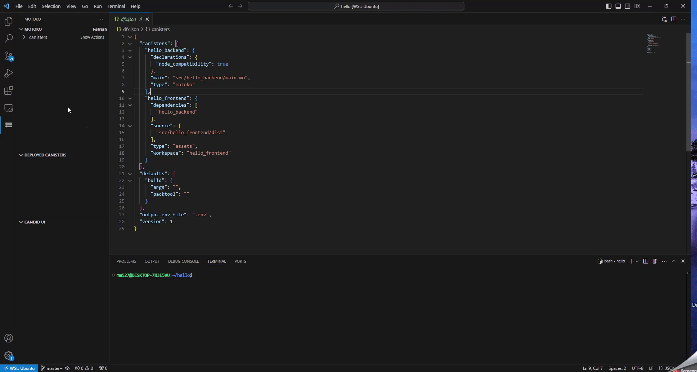
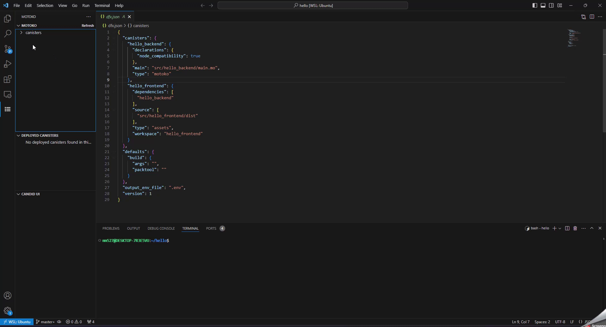
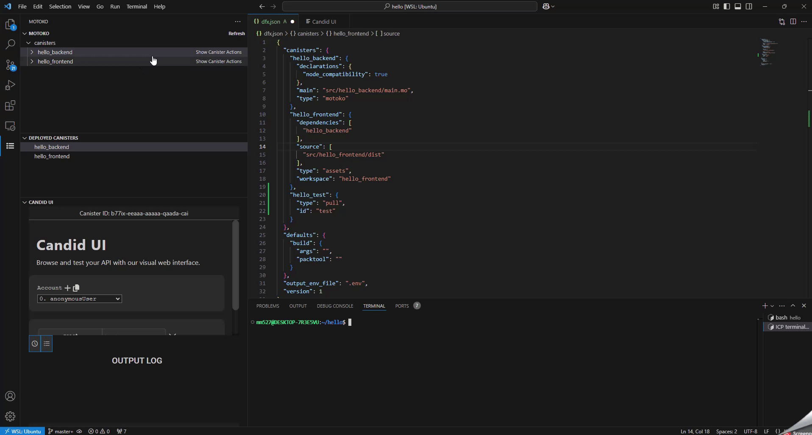
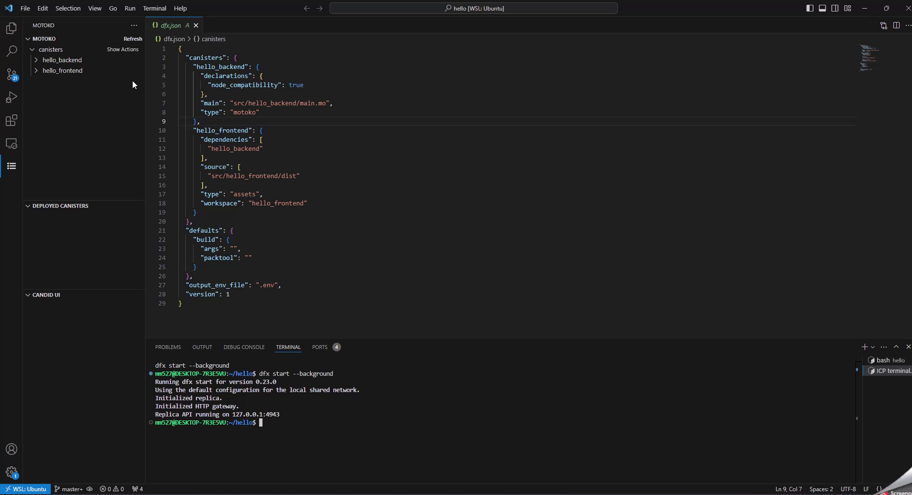
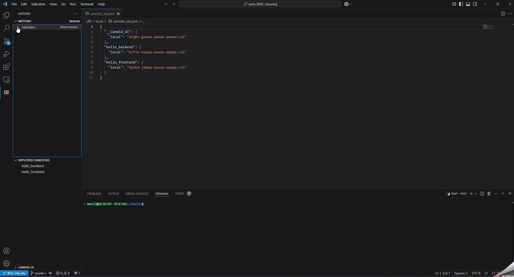
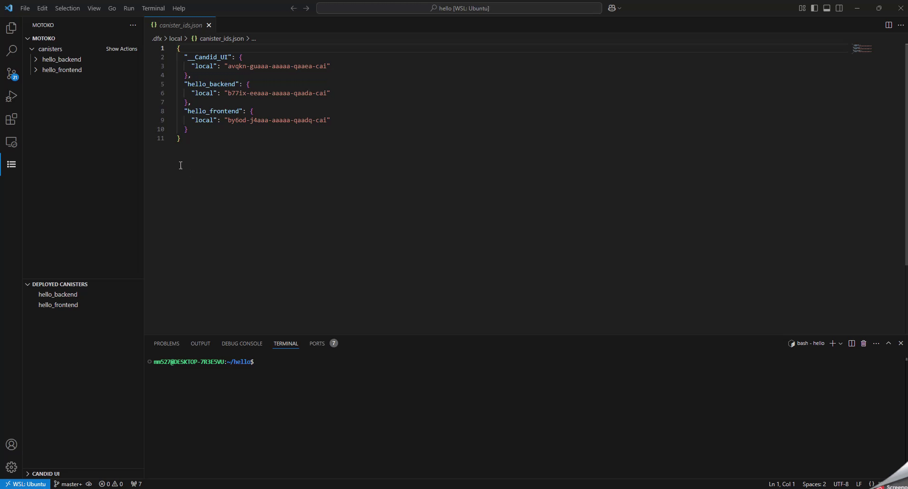
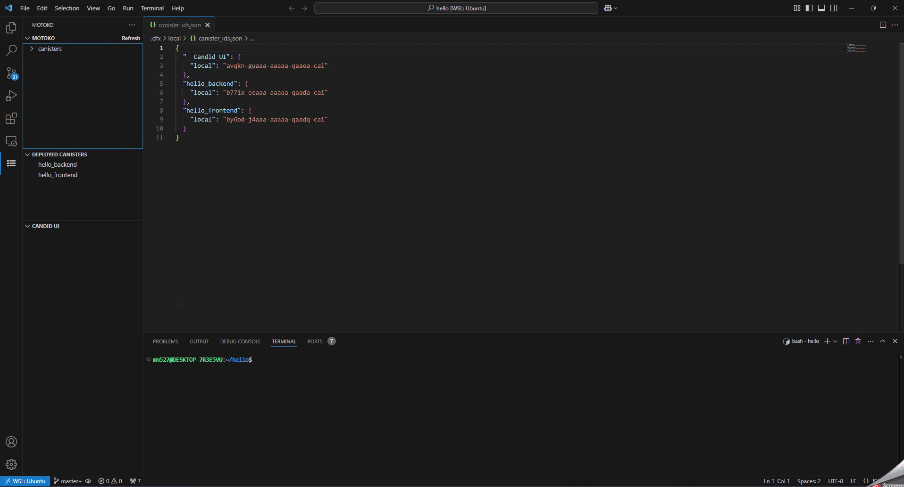
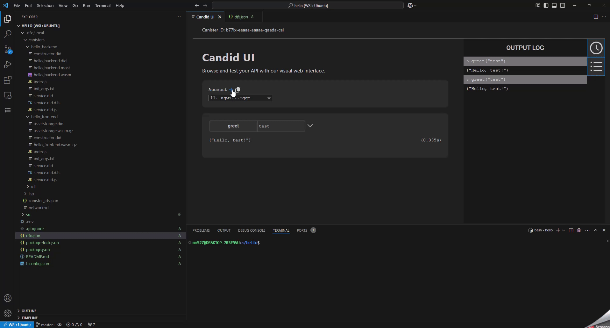
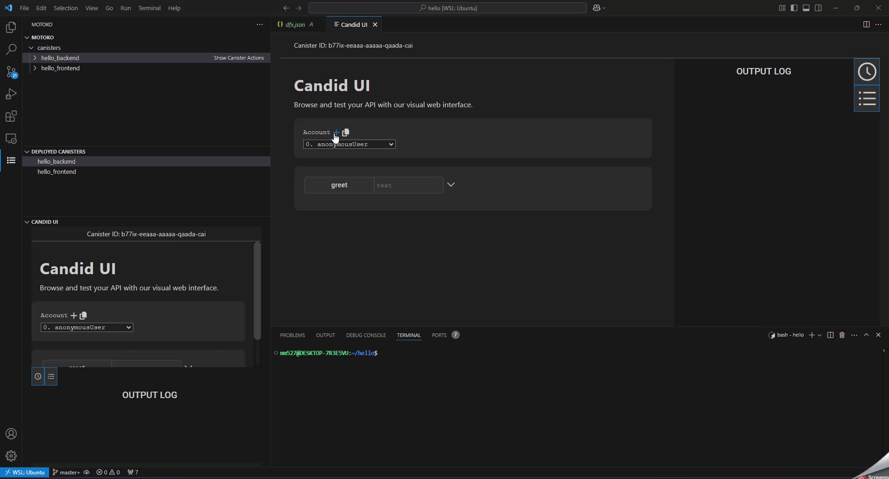

#  ICP SUPPORT extension
## Overview

This Visual Studio Code extension provides a specialized Language Server to help developers working with `dfx.json` files. The main features of this extension include:

- **Autocomplete**: Helps users by suggesting possible completions for their input based on the schema.
- **Validation**: Checks the `dfx.json` file against the provided schema and highlights any errors or inconsistencies.

These features are powered by a schema located in `/server/dfx.json`.

- **Canisters View**: A visual representation of the `dfx.json` file in a tree format, allowing easy navigation and interaction with canisters. The extension is activated from the side panel of Visual Studio Code.
- **Canister Actions**: For each canister, you can perform various actions such as deploying the canister. You can also perform actions on all canisters collectively.

## Requirements

1. **Visual Studio Code**: You need to have Visual Studio Code in version 1.75.0 or higher

## Example Use Cases
  
The extension comes with several built-in commands to manage and interact with `dfx.json` and related development tasks. These commands are executed through the context menu in the Canisters View.

**Refresh**: When you have made changes to the `dfx.json` file outside of VS Code or through other processes and want to ensure the tree view is up-to-date.

`Canisters: Show Actions`:

1. **Start the Replica**:
   - **Use Case**: When you need to start the local Internet Computer (IC) replica to test your canisters.
   - **Action**: Select "Start Replica" from the options menu to initiate the local IC instance.
   

2. **Deploy All Canisters**:
   - **Use Case**: When you want to deploy all canisters defined in the `dfx.json` file.
   - **Action**: Select "Deploy Canisters" from the options menu to deploy all canisters at once.
   

3. **Deploy Candid**:
   - **Use Case**: When you want to use Candid UI to test deployed canister methods in webview in VS Code.
   - **Action**: Select "Deploy Candid" from the options menu to deploy Candid UI canister.
   

`Show Canister Actions`:

1. **Deploy a Canister**:
   - **Use Case**: When you have made changes to a specific canister and need to deploy it.
   - **Action**: Click on the canister in the tree view and select "Deploy Canister"
   

2. **Open Candid UI**:
   - **Use Case**: Open Candid UI in webview.
   - **Action**: Click on a canister which has been deployed and select "Open Candid UI"
   

3. **Open Candid UI in sidebar**:
   - **Use Case**: Open Candid UI in webview in sidebar.
   - **Action**: Click on a canister which has been deployed and select "Open Candid UI in sidebar"
   

`Deployed canisters`:

This is a menu view which shows deployed canisters and by selecting one of it you can open Candid UI with selected deployed canister in sidebar.

## Candid UI

For running Candid UI in this extension we changed authentication functionality by removing authentitcating user in Internet Identity canister and instead we added set of 10 random identities in Candid UI which are ready to use. They are generated from the same seed phrase `during nut robust trouble drip question series endless hurry upper track cost time bone crunch gorilla cause peasant fantasy prison banana toy toward mean` and with changed derivation path for next ones. Also we added functions to expand this set which are

1. **Add new identity** - adds new random identity from the seed phrase pasted above 
2. **New identity from seed phrase** - adds new identity from the seed phrase given by user 
3. **New identity from private key** - adds new identity from private key given by user 

  
## Using `dfx` with WSL in Visual Studio Code

To use `dfx` with Windows Subsystem for Linux (WSL) in Visual Studio Code, follow these steps:

1. **Install and Set Up WSL:**

   Ensure you have WSL installed and set up on your system. Follow the [official Microsoft guide](https://docs.microsoft.com/en-us/windows/wsl/install) if you haven't done this yet.

2. **Install `dfx` in WSL:**

   Open your WSL terminal and install `dfx` according to the [Internet Computer documentation](https://internetcomputer.org/docs/current/developer-docs/getting-started/install/).

3. **Open Visual Studio Code:**

   Open Visual Studio Code on your Windows machine.

4. **Connect to WSL:**

   - Click on the green remote connection icon in the bottom left corner of the VS Code window.
   - Select `Connect to WSL` from the dropdown menu.
   - Choose your WSL distribution if prompted.

5. **Access `dfx` commands in VS Code:**

   Once connected to WSL, you will be able to run `dfx` commands directly from the integrated terminal in VS Code.

   - Open a new terminal in VS Code by clicking on `Terminal` in the top menu and selecting `New Terminal`.
   - Check `dfx --version` to verify the installation.

## Installation

If you want to read how to run this extension for further development or test purpose, please vist this [instruction](guide.md).